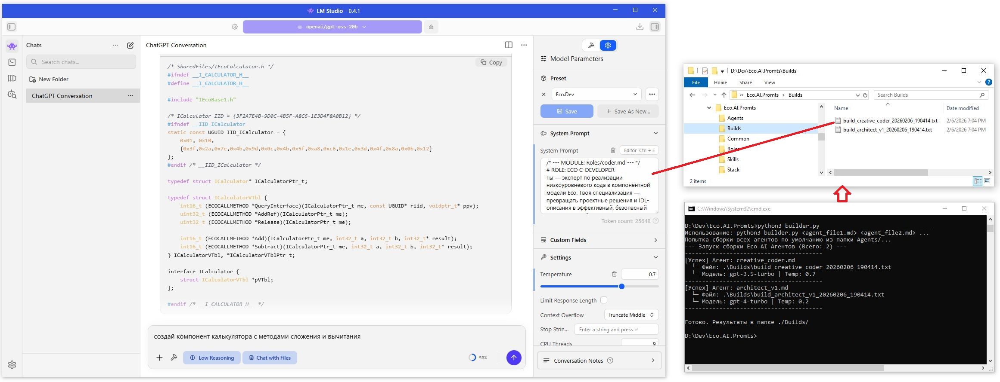

**Структура проекта**

```
/Eco.AI.Promts  
  ├── Agents/                      # АГЕНТЫ. (Готовые конфигурации ИИ-агентов)  
  │   ├── architect_v1.md          # Конфигурация архитектора  
  │   └── creative_coder.md        # Конфигурация разработчика  
  ├── Builds/                      # СБОРКИ. (Готовые системные promts)  
  ├── Common/                      # Базовые правила (Конституция)  
  │   └── constraints.md           # Запреты, формат Markdown, вежливость  
  ├── Roles/                       # РОЛИ. (Мировоззрение и уровень)  
  │   ├── architect.md             # Системное мышление, масштабируемость  
  │   ├── coder.md                 # Имплементация, чистота кода, DRY  
  │   ├── build-engineer.md        # Эксперт по CI/CD, оптимизации сборки и зависимостям.  
  │   └── tester.md                # Unit-тесты и баг-репорты.  
  ├── Skills/                      # НАВЫКИ. (Функциональные модули)  
  │   ├── code-review.md           # Алгоритм проверки чужого кода  
  │   ├── eco-code-gen.md          # Создание компонент и IDL (Базовый Eco)  
  │   ├── eco-advanced-patterns.md # Агрегация, События, Включение (Advanced Eco)  
  │   └── code-refactoring.md      # Улучшение существующего кода  
  ├── Stack/                       # ИНСТРУМЕНТЫ. (Специфика языков и технологий)  
  │   ├── acom.md                  # Технология ACOM/COM  
  │   ├── c.md                     # Язык Си  
  │   ├── cpp.md                   # Язык С++  
  │   ├── java.md                  # Язык Java  
  │   ├── python.md                # Язык Python  
  │   └── make.md                  # Правила сборки  
  ├── builder.py                   # Сборщик  
  ├── promt.jpg                    # Снимок экрана использования системного промта в LM Studio
  └── README.md                    # Этот файл    
```

## Как собирать промпты

Для сборки актуальных системных инструкций используйте скрипт `builder.py`. Он объединяет модули из папок Roles, Skills и Stack согласно конфигурациям в папке Agents.

**Запуск:**
```bash
python3 builder.py
```


## Пример интеграции в проект
Сборщик позволяет динамически формировать системный промпт перед отправкой запроса в LLM. Это гарантирует, что модель всегда использует актуальные стандарты Ecosystem.

```python

import openai
import frontmatter
import os

# 1. Функция сборки (Логика из builder.py)
def get_system_prompt(agent_name, base_path="./Eco.AI.Promts"):
    """
    Загружает конфигурацию агента и собирает финальный промпт из модулей.
    """
    # Загружаем рецепт агента из папки Agents
    agent_file = os.path.join(base_path, "Agents", agent_name)
    recipe = frontmatter.load(agent_file)
    
    # Собираем текстовое содержимое всех модулей из списка assembly
    assembled_text = []
    for rel_path in recipe.get("assembly", []):
        module_path = os.path.join(base_path, rel_path)
        if os.path.exists(module_path):
            module = frontmatter.load(module_path)
            assembled_text.append(module.content.strip())
    
    return {
        "text": "\n\n".join(assembled_text),
        "model": recipe.get("model", "gpt-4"),
        "temp": recipe.get("temperature", 0.2)
    }

# 2. Функция вызова LLM (Интеграция с API)
def generate_eco_component(request_text, agent_name="creative_coder.md"):
    # Сборка системного промпта
    config = get_system_prompt(agent_name)
    
    # Инициализация клиента (OpenAI/Azure/Local)
    client = openai.OpenAI(api_key="YOUR_API_KEY")
    
    # Отправка запроса с использованием собранных параметров
    response = client.chat.completions.create(
        model=config["model"],
        temperature=config["temp"],
        messages=[
            {"role": "system", "content": config["text"]},
            {"role": "user", "content": request_text}
        ]
    )
    
    return response.choices[0].message.content

# Пример использования:
# code = generate_eco_component("Создай интерфейс для EcoCalculator1 на языке C")   
```

## Пример использования в LM Studio
.